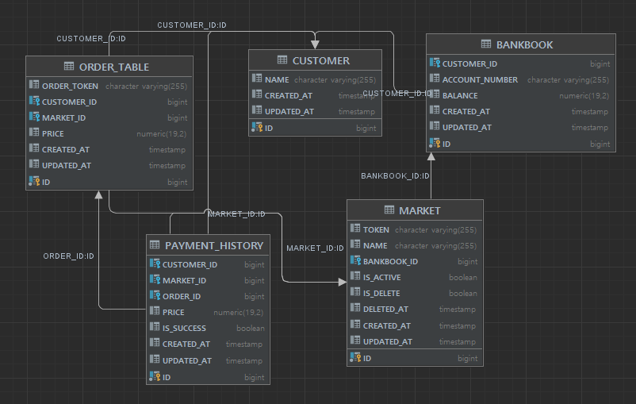

# FastCampus 일할맛2 과제!

1. 흐름도

- 사용자가 가맹점에서 결제한다.
- 가맹점의 식별자와 사용자의 계좌번호, 결제 금액, 클라이언트에서 generate 한 주문 번호(uuid)를 포함하여 api 요청을 한다.
- 가맹점이 등록이 되어있는지 확인한다.
- 주문 번호로 가장 최근에 결제한 요청이 성공했는지 여부를 확인한다.
- 만약 요청한 주문 번호가 결제 성공 했다면 "이미 성공했다" 는 에러를 발생시킨다.
- 최근 주문이 실패했거나 주문 번호가 없다면 주문을 생성한다.
- 결제 금액보다 통장 잔고가 적다면 결제 내역에 실패 했다는 상태값을 넣는다.
- 결제 금액보다 통장 잔고가 많다면 사용자의 통장에서 금액을 차감하고 가맹점의 통장에 금액을 추가한다.
- 이어서 결제 내역에 결제 성공이라는 상태값을 넣는다.

2. 발생할 수 있는 문제

- 사용자의 계좌가 결제 금액보다 돈이 많은지 확인한 뒤 사용자의 통장에서 돈을 차감하는 상황이다
- 만약 갑자기 다른 외부 결제로 인해 돈이 결제 금액보다 적게 되면 돈이 -가 된다.
- 또한 현재 계좌에서 외부 결제에 대한 동시성 처리를 하지 않아 문제가 발생한다.

  ````
  if (bankbook.balance < price) { 
      false 
  } 
  else {
    // if 문 통과하고 아래 로직이 들어갈 때 결제 금액보다 돈이 적어지게 된다면 문제가 발생
    bankbookService.payMoney(bankbook, price)
    marketService.receiveMoney(market, price)
    true
  }

3. DB 

